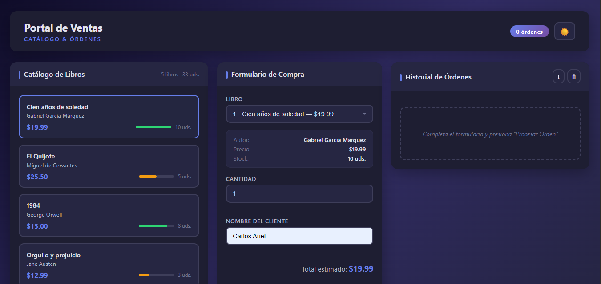
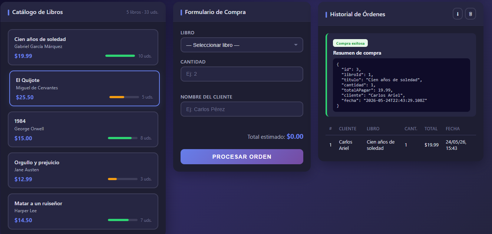
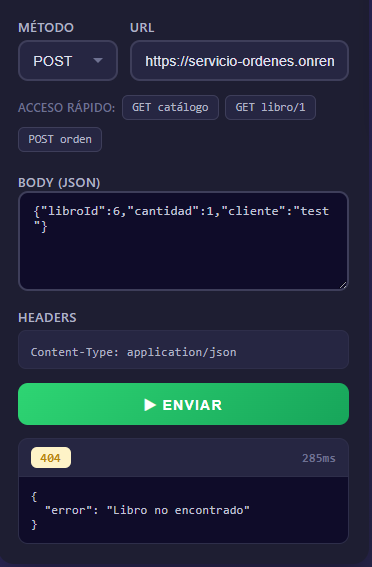
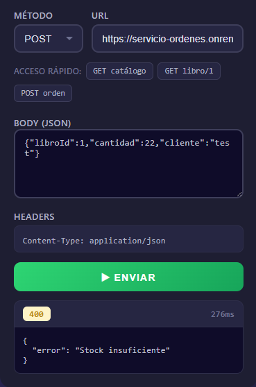
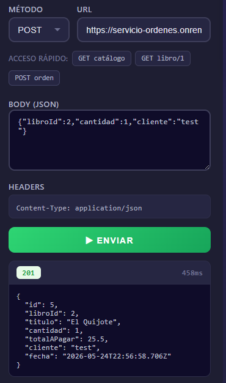

<div align="center">

# 📚 Portal de Ventas — Microservicios con Express.js

### _Arquitectura de Microservicios Node.js desplegada en Render_
### Práctica Académica — Backend Escalable


---

### 🖥 Vista General del Proyecto



---

</div>

## 📋 Tabla de Contenidos

- [📖 Descripción del Proyecto](#-descripción-del-proyecto)
- [🏗 Arquitectura del Sistema](#-arquitectura-del-sistema)
- [🛠 Tecnologías Utilizadas](#-tecnologías-utilizadas)
- [📁 Estructura del Proyecto](#-estructura-del-proyecto)
- [✅ Requerimientos Técnicos Cubiertos](#-requerimientos-técnicos-cubiertos)
- [🚀 Guía de Instalación Paso a Paso](#-guía-de-instalación-paso-a-paso)
- [📡 API Endpoints](#-api-endpoints)
- [🧪 Casos de Prueba con Evidencias](#-casos-de-prueba-con-evidencias)
- [🎨 Frontend Web](#-frontend-web)
- [☁ Despliegue en Render](#-despliegue-en-render)
- [📊 Rúbrica de Evaluación](#-rúbrica-de-evaluación)

---

## 📖 Descripción del Proyecto

Sistema backend de una **librería en línea** construido con una arquitectura de **microservicios independientes** que se comunican entre sí de forma **síncrona mediante peticiones HTTP**.

### 🔹 Motivación

> *"Cree una carpeta llamada `frontend-libreria`, con el único fin de ver las cosas, no me gusta la terminal o el Thunder-Client."* — El autor

El proyecto cuenta con una **interfaz visual completa** tipo panel administrativo para no depender de Postman o curl al hacer pruebas.

### 🔹 Flujo de funcionamiento

```
                      ┌──────────────────────────────────────┐
                      │         Frontend (index.html)         │
                      │     Portal de Ventas Administrativo    │
                      └──────────────────┬───────────────────┘
                                         │
                                         ▼  POST /api/ordenes
                               ┌───────────────────┐
                               │  Servicio de       │
                               │  Órdenes           │
                               │  (Puerto 3002)     │
                               │                    │
                               │  Procesa compras   │
                               │  consultando al    │
                               │  catálogo vía HTTP │
                               └────────┬──────────┘
                                         │
                                         ▼  GET /api/libros/:id
                               ┌───────────────────┐
                               │  Servicio de       │
                               │  Catálogo          │
                               │  (Puerto 3001)     │
                               │                    │
                               │  5 libros en       │
                               │  memoria con       │
                               │  id, titulo, autor,│
                               │  precio y stock    │
                               └───────────────────┘
```

---

## 🏗 Arquitectura del Sistema

| Servicio | Puerto | Dependencias | Descripción |
|----------|--------|-------------|-------------|
| **servicio-catalogo** | `3001` | express, cors, dotenv | Gestiona inventario de libros. Tiene 5 libros en memoria con `id`, `titulo`, `autor`, `precio` y `stock`. Expone `GET /api/libros` y `GET /api/libros/:id`. No necesita axios porque no consulta a ningún otro servicio. |
| **servicio-ordenes** | `3002` | express, axios, cors, dotenv | Procesa compras. Tiene un arreglo vacío `ordenes` donde se guardan las compras. Expone `POST /api/ordenes`. Usa axios para consultar al catálogo y verificar stock. Depende de la variable `CATALOGO_URL`. |
| **frontend-libreria** | — | — | Interfaz visual que consume la API. Panel administrativo con catálogo, formulario inteligente y modo Postman integrado. |

### Diagrama de comunicación entre servicios

```
POST /api/ordenes                    GET /api/libros/:id
  { libroId, cantidad, cliente } ───────►  { id, titulo, autor, precio, stock }
       │                                          │
       │ ◄────────────────────────────────────────┘
       │         (200 + datos del libro)
       │
       ├── ✅ ¿Existe el libro?      NO  →  res 404 "Libro no encontrado"
       ├── ✅ ¿Stock suficiente?      NO  →  res 400 "Stock insuficiente"
       └── ✅ Todo correcto                →  res 201 + resumen de orden
```

---

## 🛠 Tecnologías Utilizadas

| Tecnología | Versión | Propósito |
|-----------|---------|-----------|
| **Node.js** | v20+ | Entorno de ejecución JavaScript |
| **Express** | 5.2.1 | Framework web para construcción de APIs REST |
| **Axios** | 1.16.1 | Cliente HTTP para comunicación entre microservicios |
| **CORS** | 2.8.6 | Middleware para habilitar peticiones cross-origin |
| **Dotenv** | 17.4.2 | Manejo de variables de entorno |
| **Render** | — | Plataforma cloud para despliegue (free tier) |

---

## 📁 Estructura del Proyecto

```
PracticaMicroservicios/
│
├── servicio-catalogo/                  # 📦 Microservicio #1 — Catálogo
│   ├── index.js                        # Lógica: GET /api/libros, GET /api/libros/:id
│   ├── package.json                    # express, cors, dotenv
│   └── package-lock.json
│
├── servicio-ordenes/                   # 📦 Microservicio #2 — Órdenes
│   ├── index.js                        # Lógica: POST /api/ordenes
│   ├── package.json                    # express, axios, cors, dotenv
│   └── package-lock.json
│
├── frontend-libreria/                  # 🎨 Interfaz gráfica
│   ├── index.html                      # Portal administrativo
│   ├── styles.css                      # Estilos (dark mode, responsive, animaciones)
│   └── app.js                          # Lógica frontend (fetch, toasts, confetti)
│
├── Imagenes/                           # 🖼 Capturas de pantalla
│   ├── CompraExitosa201.png
│   ├── ImagenPantallaCompleta.png
│   ├── LibroNoEncontrado404.png
│   ├── PantallaCompletaOrdenEjecutada.png
│   └── StockInsuficiente400.png
│
├── .gitignore                          # node_modules/ y .env excluidos
├── Microservicios con Express.docx     # Documento explicativo de la actividad
└── README.md                           # ← Este archivo
```

> 📌 **Nota:** `node_modules/` está en el `.gitignore`, por lo que no se sube a GitHub. En Render se genera automáticamente al hacer deploy con `npm install`.

---

## ✅ Requerimientos Técnicos Cubiertos

### 🔵 Parte 1: Servicio de Catálogo (Puerto 3001)

| # | Requisito | Estado | Ubicación |
|---|-----------|--------|-----------|
| 1 | Arreglo en memoria con 5+ libros (`id`, `titulo`, `autor`, `precio`) | ✅ | `servicio-catalogo/index.js:10-16` |
| 2 | Endpoint `GET /api/libros` (lista completa) | ✅ | `servicio-catalogo/index.js:18-20` |
| 3 | Endpoint `GET /api/libros/:id` | ✅ | `servicio-catalogo/index.js:22-31` |
| 4 | Éxito: retorna libro con `200 OK` | ✅ | `res.status(200).json(libro)` |
| 5 | Error: libro no existe → `404` con JSON | ✅ | `res.status(404).json({ error: 'Libro no encontrado' })` |

### 🟢 Parte 2: Servicio de Órdenes (Puerto 3002)

| # | Requisito | Estado | Ubicación |
|---|-----------|--------|-----------|
| 1 | Arreglo vacío `ordenes` en memoria | ✅ | `servicio-ordenes/index.js:13` |
| 2 | Endpoint `POST /api/ordenes` con body `{libroId, cantidad, cliente}` | ✅ | `servicio-ordenes/index.js:15-46` |
| 3 | Usa Axios para consultar al catálogo (`GET /api/libros/:id`) | ✅ | `servicio-ordenes/index.js:19` |
| 4 | Catálogo responde 404 → Órdenes responde 404 | ✅ | `servicio-ordenes/index.js:41-42` |
| 5 | Catálogo responde 200 → calcula total, guarda orden, responde 201 | ✅ | `servicio-ordenes/index.js:26-38` |

### 🟡 Reto Extra: Validación de Stock

| # | Requisito | Estado | Ubicación |
|---|-----------|--------|-----------|
| 1 | Propiedad `stock` en cada libro | ✅ | `servicio-catalogo/index.js:11-15` |
| 2 | Validar stock antes de procesar orden | ✅ | `servicio-ordenes/index.js:22-24` |
| 3 | Rechazar con `400` si stock insuficiente | ✅ | `res.status(400).json({ error: 'Stock insuficiente' })` |

---

## 🚀 Guía de Instalación Paso a Paso

### Prerrequisitos

- [Node.js](https://nodejs.org/) v18 o superior
- npm (incluido con Node.js)
- Opcional: [Postman](https://www.postman.com/) Thunder Client (VSCode), o simplemente usa el frontend incluido

### 1. Clonar el repositorio

```bash
git clone https://github.com/carlosarielcuadrascamacho-svg/PracticaMicroservicios.git
cd PracticaMicroservicios
```

### 2. Instalar dependencias del Catálogo

```bash
cd servicio-catalogo
npm install
```

Esto instalará: `express`, `cors`, `dotenv`

### 3. Instalar dependencias de Órdenes

```bash
cd ../servicio-ordenes
npm install
```

Esto instalará: `express`, `axios`, `cors`, `dotenv`

### 4. Iniciar los servicios

Abre **dos terminales** distintas:

**Terminal 1 — Catálogo (puerto 3001):**
```bash
cd servicio-catalogo
npm start
# → Servicio de Catálogo corriendo en puerto 3001
```

**Terminal 2 — Órdenes (puerto 3002):**
```bash
cd servicio-ordenes
npm start
# → Servicio de Órdenes corriendo en puerto 3002
```

> ⚙️ Para cambiar puertos o configurar localmente, crea un archivo `.env` en cada carpeta:
>
> `servicio-catalogo/.env`:
> ```
> PORT=3001
> ```
>
> `servicio-ordenes/.env`:
> ```
> PORT=3002
> CATALOGO_URL=http://localhost:3001
> ```

### 5. Abrir el Frontend

Simplemente abre `frontend-libreria/index.html` en tu navegador favorito:

```bash
start frontend-libreria/index.html
```

---

## 📡 API Endpoints

### 📖 Servicio de Catálogo — `https://servicio-catalogo.onrender.com`

#### `GET /api/libros`
Devuelve el listado completo de libros disponibles en el inventario.

<details>
<summary>📥 Respuesta (200 OK)</summary>

```json
[
  { "id": 1, "titulo": "Cien años de soledad", "autor": "Gabriel García Márquez", "precio": 19.99, "stock": 10 },
  { "id": 2, "titulo": "El Quijote", "autor": "Miguel de Cervantes", "precio": 25.50, "stock": 5 },
  { "id": 3, "titulo": "1984", "autor": "George Orwell", "precio": 15.00, "stock": 8 },
  { "id": 4, "titulo": "Orgullo y prejuicio", "autor": "Jane Austen", "precio": 12.99, "stock": 3 },
  { "id": 5, "titulo": "Matar a un ruiseñor", "autor": "Harper Lee", "precio": 14.50, "stock": 7 }
]
```
</details>

#### `GET /api/libros/:id`
Devuelve la información de un libro específico por su ID.

<details>
<summary>📥 Respuesta (200 OK) — Libro existe</summary>

```json
{ "id": 1, "titulo": "Cien años de soledad", "autor": "Gabriel García Márquez", "precio": 19.99, "stock": 10 }
```
</details>

<details>
<summary>📥 Respuesta (404 Not Found) — Libro no existe</summary>

```json
{ "error": "Libro no encontrado" }
```
</details>

---

### 📦 Servicio de Órdenes — `https://servicio-ordenes.onrender.com`

#### `POST /api/ordenes`
Procesa la compra de un libro. Este endpoint internamente consulta al **Servicio de Catálogo** usando Axios para verificar que el libro existe y que hay stock suficiente antes de aceptar la orden.

<details>
<summary>📤 Request Body</summary>

```json
{
  "libroId": 1,
  "cantidad": 2,
  "cliente": "Carlos Pérez"
}
```
</details>

<details>
<summary>📥 Respuesta (201 Created) — ✅ Compra exitosa</summary>

```json
{
  "id": 1,
  "libroId": 1,
  "titulo": "Cien años de soledad",
  "cantidad": 2,
  "totalAPagar": 39.98,
  "cliente": "Carlos Pérez",
  "fecha": "2026-05-24T22:30:59.757Z"
}
```
</details>

<details>
<summary>📥 Respuesta (400 Bad Request) — ❌ Stock insuficiente</summary>

```json
{ "error": "Stock insuficiente" }
```
</details>

<details>
<summary>📥 Respuesta (404 Not Found) — ❌ Libro no existe</summary>

```json
{ "error": "Libro no encontrado" }
```
</details>

---

## 🧪 Casos de Prueba con Evidencias

### 📸 Vista completa del panel principal

La interfaz gráfica permite visualizar el catálogo, llenar el formulario y ver los resultados todo en una misma pantalla:


---

### 🧪 Caso 1: Compra exitosa ✅

Seleccionamos un libro, indicamos cantidad y cliente, y presionamos **Procesar Orden**.

| Campo | Valor |
|-------|-------|
| Libro | Cien años de soledad (ID: 1) |
| Cantidad | 2 |
| Cliente | Carlos |

**Resultado:** La orden se procesa correctamente y se muestra el resumen con el total a pagar.



**Respuesta del backend (201 Created):**
```json
{
  "id": 1,
  "libroId": 1,
  "titulo": "Cien años de soledad",
  "cantidad": 2,
  "totalAPagar": 39.98,
  "cliente": "Carlos",
  "fecha": "2026-05-24T22:30:59.757Z"
}
```

A nivel de código, esto equivale a la siguiente petición curl:
```bash
curl -X POST https://servicio-ordenes.onrender.com/api/ordenes \
  -H "Content-Type: application/json" \
  -d '{"libroId":1,"cantidad":2,"cliente":"Carlos"}'
```

---

### 🧪 Caso 2: Libro no encontrado ❌

Intentamos comprar un libro con un ID que no existe en el catálogo para verificar que el **manejo de errores 404** funciona correctamente.

| Campo | Valor |
|-------|-------|
| Libro | ID: 99 (no existe) |
| Cantidad | 1 |
| Cliente | Carlos |

**Resultado:** El servicio rechaza la compra y muestra el error **"Libro no encontrado"**.



**Respuesta del backend (404 Not Found):**
```json
{ "error": "Libro no encontrado" }
```

```bash
curl -X POST https://servicio-ordenes.onrender.com/api/ordenes \
  -H "Content-Type: application/json" \
  -d '{"libroId":99,"cantidad":1,"cliente":"Carlos"}'
```

---

### 🧪 Caso 3: Stock insuficiente ❌

Intentamos comprar más unidades de las que hay disponibles para verificar que la **validación de stock** funciona correctamente.

| Campo | Valor |
|-------|-------|
| Libro | Orgullo y prejuicio (Stock: 3) |
| Cantidad | 99 |
| Cliente | Carlos |

**Resultado:** El servicio rechaza la compra por **"Stock insuficiente"**.



**Respuesta del backend (400 Bad Request):**
```json
{ "error": "Stock insuficiente" }
```

```bash
curl -X POST https://servicio-ordenes.onrender.com/api/ordenes \
  -H "Content-Type: application/json" \
  -d '{"libroId":4,"cantidad":99,"cliente":"Carlos"}'
```

### 📸 Captura directa del resultado exitoso



---

## 🎨 Frontend Web

El proyecto incluye un panel administrativo completo que consume los microservicios desde el navegador, sin necesidad de Postman ni terminal.

### Funcionalidades incluidas

| Categoría | Feature | Descripción |
|-----------|---------|-------------|
| 🎯 **Catálogo** | Grid visual de libros | Tarjetas con título, autor, precio y barra de stock (verde/amarillo/roja). Click para autocompletar formulario. |
| 📝 **Formulario** | Select inteligente | Dropdown con todos los libros, vista previa de autor/precio/stock, cálculo de total en vivo |
| 🧪 **Modo Prueba** | Postman integrado | Editor libre con método GET/POST, URL, body JSON, respuesta cruda con status code coloreado y tiempo de respuesta |
| 📊 **Historial** | Tabla persistente | Órdenes guardadas en localStorage con ID, cliente, libro, cantidad, total y fecha |
| 💾 **Exportar CSV** | Descarga | Botón para descargar el historial de órdenes en formato CSV |
| 🌙 **Dark Mode** | Toggle sol/luna | Cambia toda la interfaz al tema oscuro con persistencia en localStorage |
| 🔔 **Notificaciones** | Toast system | Notificaciones animadas en esquina superior con auto-dismiss (éxito/error/warning) |
| 🎊 **Confetti** | Animación | Lluvia de colores al realizar una compra exitosa |
| ⌨️ **Atajos** | Tecla Escape | Limpia el formulario al presionar Escape |
| 📱 **Responsive** | 3 diseños | 3 columnas en desktop, 2 en tablet, 1 en mobile |

### Cómo abrirlo

```bash
start frontend-libreria/index.html
```

O simplemente haz **doble clic** en el archivo `frontend-libreria/index.html`.

---

## ☁ Despliegue en Render

Ambos servicios están desplegados en [Render](https://render.com/) usando el plan gratuito.

### URLs de los servicios en producción

| Servicio | URL |
|----------|-----|
| Catálogo | [https://servicio-catalogo.onrender.com](https://servicio-catalogo.onrender.com/api/libros) |
| Órdenes | [https://servicio-ordenes.onrender.com](https://servicio-ordenes.onrender.com) |

### Configuración en Render

| Servicio | Build Command | Start Command |
|----------|--------------|---------------|
| Catálogo | `npm install` | `npm start` |
| Órdenes | `npm install` | `npm start` |

### Variables de entorno requeridas

#### servicio-ordenes (OBLIGATORIO)

| Variable | Valor | Propósito |
|----------|-------|-----------|
| `CATALOGO_URL` | `https://servicio-catalogo.onrender.com` | URL del catálogo para que órdenes pueda consultar libros |

Sin esta variable, el servicio de órdenes intentará conectarse a `http://localhost:3001` (que no existe en la nube) y fallará.

### Redeploy manual

1. Ir al [Dashboard de Render](https://dashboard.render.com/)
2. Seleccionar el servicio (catalogo u ordenes)
3. Ir a **Manual Deploy → Deploy latest commit**

---

## 📊 Rúbrica de Evaluación

| Criterio | Ponderación | Cumplimiento | Evidencia |
|----------|:-----------:|:------------:|-----------|
| **Configuración** — Ambos servicios inicializados correctamente en puertos distintos con Express | 20% | ✅ | `servicio-catalogo/package.json`, `servicio-ordenes/package.json`, puertos 3001 y 3002 |
| **Servicio de Catálogo** — GET responde correctamente y maneja error 404 si libro no existe | 25% | ✅ | `servicio-catalogo/index.js:18-31` — `GET /api/libros/:id` con 200 y 404 |
| **Comunicación HTTP** — Órdenes usa Axios para consultar al Catálogo | 30% | ✅ | `servicio-ordenes/index.js:19` — `axios.get(\`${CATALOGO_URL}/api/libros/${libroId}\`)` |
| **Manejo de Respuestas** — Calcula total y responde adecuadamente según lo que dictó el Catálogo | 25% | ✅ | `servicio-ordenes/index.js:22-42` — 201 éxito, 404 no encontrado, 500 error comunicación |
| **Reto Extra (Stock)** — Validación de stock y rechazo de orden si no hay suficiente | +Extra | ✅ | `servicio-ordenes/index.js:22-24` — `if (cantidad > libro.stock) → return 400` |

### Comandos para verificar cada criterio

```bash
# ✅ Criterio 1: Ambos servicios responden
curl https://servicio-catalogo.onrender.com/api/libros
curl -X POST https://servicio-ordenes.onrender.com/api/ordenes -H "Content-Type: application/json" -d '{"libroId":1,"cantidad":1,"cliente":"test"}'

# ✅ Criterio 2: Catálogo maneja 404
curl https://servicio-catalogo.onrender.com/api/libros/99

# ✅ Criterios 3 y 4: Órdenes se comunica con catálogo y maneja respuestas
curl -X POST https://servicio-ordenes.onrender.com/api/ordenes -H "Content-Type: application/json" -d '{"libroId":1,"cantidad":1,"cliente":"Carlos"}'

# ✅ Reto Extra: Validación de stock
curl -X POST https://servicio-ordenes.onrender.com/api/ordenes -H "Content-Type: application/json" -d '{"libroId":4,"cantidad":99,"cliente":"Carlos"}'
```

---

<div align="center">

---

### 👨‍💻 Desarrollado por

## **Carlos Ariel Cuadras Camacho**

[](https://github.com/carlosarielcuadrascamacho-svg)

**Práctica de Microservicios con Node.js y Express**  
Mayo 2026

[🔼 Volver al inicio](#-portal-de-ventas--microservicios-con-expressjs)

</div>
